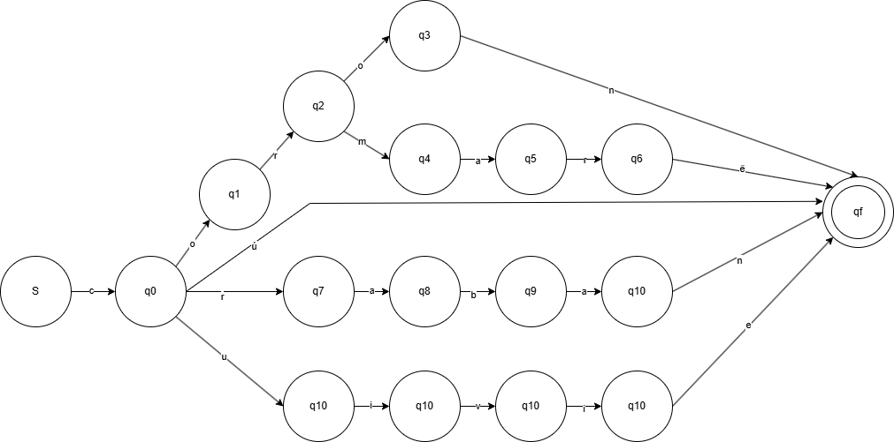

# TC_2037_AnalisisLexico_Elven
El objetivo de este proyecto es hacer evidencia de lo aprendido en clase sobre autómatas y expresiones regulares en el análisis de lenguajes. Parte de la evidencia será analizar el léxico de un lenguaje utilizando ciertas palabaras como base para determinar si son parte del lenguaje o no. Este proyecto cubre el diseño e implementación de un autómata y una expresión regular para cumplir este objetivo, junto con pruebas para demostrar su correcta implementación, un reporte sobre lo desarrollado junto a argumentación citada y un análisis de complejidad del proyecto.

## -------------------- Lenguaje seleccionado --------------------

Para el proyecto se implementaron 5 palabras del léxico Elven, siendo las siguientes: 

1. Cormarë - Palabra Quenya que siginifca 'Día de anillo'. El nacimiento de Frodo y   y Bilbo Baggins.
2. Coron - mound.
3. Craban - Palabra sindari que hace referencia a una especie poco amistosa de cuervos negros.
4. Cú - Arco.
5. Cuivie - Despertar.

## -------------------- Autómata implentado -------------------- 
Para el proyecto se decidio implementar un Autómata Finito Determinista (DFA). El cual se caracterísa por tener un número finito de estados a los cuales el autómata se puede mover, este se navega de la siguiente forma:
- Se ingresa un string al autómata.
- El autómata toma el string y lo divide en caracteres.
- Navega caracter por caracter moviendose entre estados.
- Si llega al estado final el string es correcto, si no llega al estado final el string es rechazado.

Para profundizar mejor en el autómata implementado se va a definir el diccionario o los objetos del DFA:
- Q (Conjunto de estados) - Siendo estos (s,q0,q1,q2,q3,q4,q5,q6,q7,q8,q9,q10,q11,q12,q13,q14,qf).
- Σ (alfabeto) - Conjunto de caracteres únicos aceptados (c,o,r,m,a,ë,n,b,ú,u,i,v,e).
- $\delta$ (función de transición) - Función que define un estado base, estado al que se mueve, y caractér necesario para hacer el movimiento, definido en este proyecto como: $\delta$ transition(estado origen, estado destino, caractér necesario).
- q0 (Estado inicial) - Definida por el estado s, en el automata se ve como: start(s).
- F (Estado aceptado) - Definida por el estado qf, de forma que si la transición termina en (qn, qf, caractér) es tomado como palabra válida.

## -------------------- Argumentación Autómata -------------------- 
Según Aho et al. (2008) en Compilers: Principles, Techniques, and Tools, un Autómata Finito Determinista (DFA) es una herramienta ideal para el análisis léxico ya que permite reconocer patrones de manera eficiente. Mi implementación en Prolog cumple con la propiedad fundamental de un DFA: la **determinación**.

Para cualquier estado $s$ y símbolo de entrada $a$, existe a lo sumo una transición, lo que evita el backtracking innecesario durante el escaneo de la palabra. El predicado parse_list/2 implementa esta lógica mediante recursión de cola, lo que garantiza que el análisis de una palabra de longitud $n$ se realice en un tiempo lineal $O(n)$. Por otro lado para respetar la parte deterministica del autómata, en prolog se programo de manera que si se pone un caractér que no forma parte del alfabeto especificado o no tiene transición se determina que esa palabra es falsa, asi se evita entrar en un estado no deterministico sin usar casos pozo.

### Navegación de Autómata

El diseño sigue las convenciones de implementación de analizadores léxicos mencionados por **Aho et al.**, pero se omite el uso de un caso de fallo. Cualquier transición no ilustrada se toma como incorrecta automáticamente, asi se logra un comportamiento deterministico.

### Tabla de Estados y Transiciones
| Estado Origen| Estado destino| Caractér|
|--------------|---------------|---------|
| S | q0 | c  |
| q0 | q1 | o |
| q1 | q2 | r |
| q2 | q3 | o |
| q3 | qf | n |
| q2 | q4 | m |
| q4 | q5 | a |
| q5 | q6 | r |
| q6 | qf | ë |
| q0 | q7 | r |
| q7 | q8 | a |
| q8 | q9 | b |
| q9 | q10 | a |
| q10 | qf | n |
| q0 | qf | ú |
| q0 | q11 | u |
| q11 | q12 | i |
| q12 | q13 | v |
| q13 | q14 | i |
| q14 | qf | e |

## -------------------- Análisis de Expresión Regular (RegEx) -------------------- 
Para la implementación del RegEx se utilizo python con el apoyo del módulo re. El RegEx utilizado es una traducción directa del autómata implementado:

### Expresión:
^(c(or(on|marë)|(raban)|(ú)|(uivie)))$

### Desglose:
- ^ y $: Sirven para darle inicio y fin a un string, de forma que la cadena completa debe de cumplir con la expresión y que no haya casos donde un pedazo de la cadena cumpla por lo que todo cumple, ejemplo (cuivie pasa, pero xxxxxcuiviexxxxx no debería pasar aunque dento del a cadena este una palabra valida).
- Prefijo común c: Es la transición del estado inicio s a q0, del cual parten todas las palabras.
- Uso de agrupación **()** y alternación **|**: El RegEx se agrupa basandose en patrones comunes y se alterna para generar las bifurcaciones, por ejemplo el caso de c(or(on|marë)) sirve para representar las palabras *coron* o *cormarë* las cuales inician con las primeras tres letras **cor** en la siguiente parte ((raban)|(ú)|(uivie)) se definen el resto de palabras que solo tienen en común el inicio de la palabra (*c*) de forma que se lee craban *o* cú *o* cuivie.

## -------------------- Análisis de Complejidad -------------------- 
### DFA
Basandonos en lo establecido por el libro Compilers el DFA en Prolog tiene una complejidad temporal de *O(n)* y una complejidad espacial de *O(1)*. Esto ya que se elimina el backtracking usando el operador de corte **(!)**, así el autómata lee cada caractér exactamente una vez. Si encuentra una transición sigue avanzando hasta terminar la lista donde se determina si es un caso válido o inválido, si en un momento no encuentra transición se toma como un caso inválido.

### RegEx
En este caso la complejidad se mantiene también en *O(n)*. Esto porque todo el tiempo es líneal, desde que el programa recorre un string de tamaño n, qué, como es una operación simple de ver el caractér se mantiene en tiempo lineal. Iterar por el string también se mantiene en tiempo lineal porque no hay ninguna especie de backtracking o algo que aumente la complejidad.

## -------------------- Guía de ejecución de programas y pruebas -------------------- 
### DFA (Automata)
El archivo *Automata_elven.pl* contiene las transiciónes y el recorrido que tiene que hacer el DFA. Para correr el programa en terminal se usan las siguientes instrucciones:
1. Al abrir la carpeta entrar en la subcarpeta de Automata.
2. Escribir *swipl* (Si no funciona puede ser porque no tiene instalado ProLog en su computadora).
3. Cargar el archivo escribiendo *["Automata_elven.pl"].* (Nota: es importante poner el punto del final)
4. Ejecutar la función *is_elven(string).* donde el string es una palabra de longitud n. (Nota: es importante poner el punto del final).

Los resultados se ven de la siguiente manera:
- coron: Is part of the Elven Language
- cormarë: Is part of the Elven Language
- craban: Is part of the Elven Language

### Expresión Regular (Implementación en python)
La implementación de la expresión regular se encuentra dentro de la carpeta de Regex. Para correr el programa en terminal es importante entrar a esta carpeta y seguir las siguientes instrucciones:
1. Escribir python regex_elven.py (si no funciona prueba con python 3 regex_elven.py)
2. El programa va a pedir que ingreses una palabra para verificar si es parte del lenguaje elven se puede ingresar cualquier string de tamaño n.
3. Para salir basta con que metas un string vacio y con esto se cierra el programa.

Los resultados se ven de la siguiente manera: 
- The string:  craban  is part of the elven language
- The string:  cormarë  is part of the elven language
- The string:  cú  is part of the elven language

### DFA (TEST)
El archivo *Automata_test.pl* contiene todos los casos de prueba hechos para el DFA. Para correr el programa en terminal se usan las siguientes instrucciones:
1. Al abrir la carpeta entrar en la subcarpeta de Automata.
2. Escribir *swipl* (Si no funciona puede ser porque no tiene instalado ProLog en su computadora).
3. Cargar el archivo escribiendo *["Automata_test.pl"].* (Nota: es importante poner el punto del final)
4. Ejecutar la función *run_tests.* (Nota: es importante poner el punto del final).

Los resultados se ven de la siguiente manera:
- coron: Is part of the Elven Language
- cormarë: Is part of the Elven Language
- craban: Is part of the Elven Language

### Expresión Regular (TEST en python)
La implementación de las pruebas de la expresión regular. Para correr el programa en terminal es importante entrar a esta carpeta y seguir las siguientes instrucciones:
1. Escribir python regex_tests.py (si no funciona prueba con python 3 regex_tests.py)
2. El programa va a correr todas las pruebas

Los resultados se ven de la siguiente manera: 
- The string:  craban  is part of the elven language
- The string:  cormarë  is part of the elven language
- The string:  cú  is part of the elven language

Al finalizar las pruebas, si todas pasaron va a mostrar el siguiente mensaje: 

*"Ran 3 tests in 0.001s

OK"*

## -------------------- Conclusiones -------------------- 
Analizando las complejidades tanto de la expresión regular como del autómata se puede ver que ambas son opciones igual de viables para hacer un análisis léxico.

Aunque una de las mayores diferencias es su facilidad de implementación en algun programa. La librería re es un gran apoyo en python para poder recorrer expresiones regulares con facilidad, lo que hace que la expresión regular tenga una fuerte ventaja. Por lo que considero es la opción más viable para poder hacer un análisis de este tipo.

## -------------------- Referencias -------------------- 
- Aho, A. V., Lam, M. S., Sethi, R., & Ullman, J. D. (2008). Compilers: Principles, Techniques, and Tools (2nd ed.). Pearson Education / Addison Wesley. (Específicamente Capítulos 2.6 y 3.1 para el diseño de analizadores léxicos y DFA).
- Python Software Foundation. (2026). re — Regular expression operations. Python 3.12 Documentation. Recuperado de https://docs.python.org/3/library/re.html
- Python Software Foundation. (2026). Built-in Types: str.split and list constructors. Python 3.12 Documentation. Recuperado de https://docs.python.org/3/library/stdtypes.html#text-sequence-type-str (Referencia para la manipulación de strings y conversión a listas en el analizador).
- SWI-Prolog. (2026). SWI-Prolog 9.2 Reference Manual: atom_chars/2. Recuperado de https://www.swi-prolog.org/pldoc/man?predicate=atom_chars/2 (Referencia para la descomposición de átomos en caracteres para el DFA).